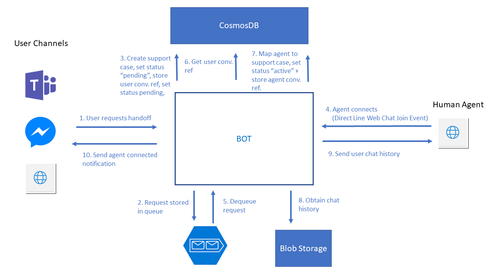
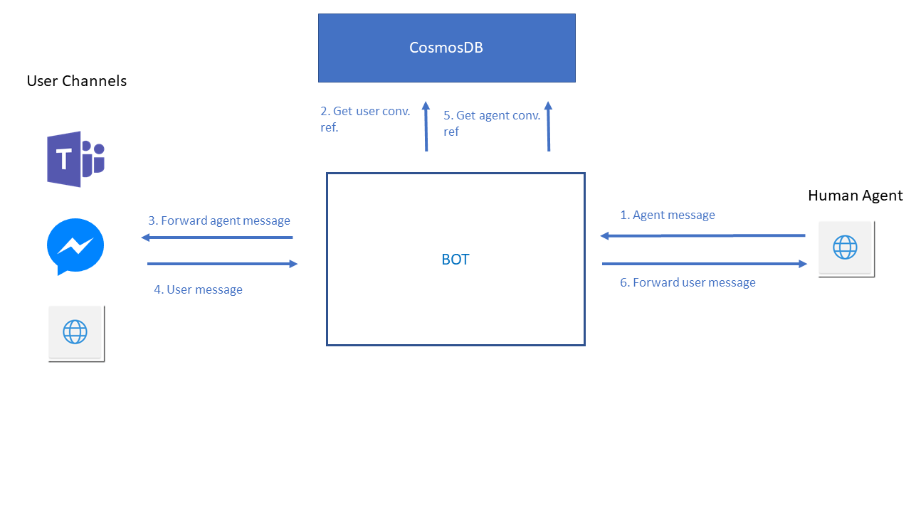
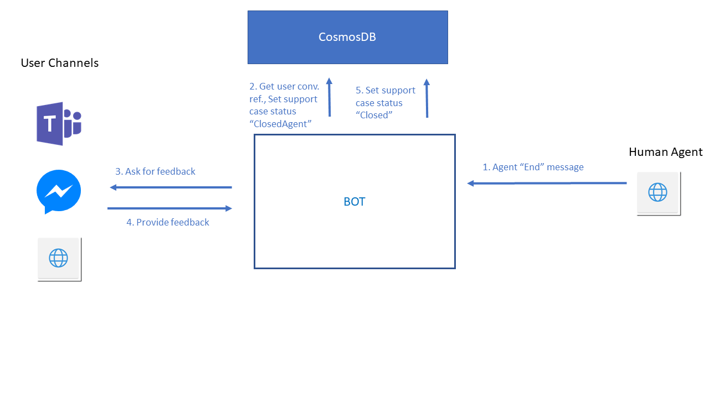

# Human agent handoff with Bot Framework v4 (Node.js)

This repository contains sample code which implements **human handoff logic** using Bot Framework v4 SDK in Node.js. This handoff includes also functionality of **feeding newly connected agent chat window** with previous **chat history** between bot and user, who requested handoff to human agent.

On user side this code supports all channels supported by Bot Service. Human agent side is implemented as simple console on top of Web Chat component connected to Bot Application thru Direct Line. 

**Note**: This is prove of concept solution and for production ready use it requires further development. This text is not describing basic concepts behind Bot Framework and it is recommended, you have some knowledge of Bot Framework SDK before continuing with reading this text. 

## Prerequisites  

Besides using Bot Framework and Bot Service, solution is using several other Azure Services, namely:

- **CosmosDB** - to store conversation references, agent support cases and conversation states.

- **Azure Storage** 
  - Blob storage to store transcripts (history of conversations)
  - Storage queue to store incoming support requests and hand them over to human agent in FIFO manner.

- **Azure Functions** - extraction of user chat history is currently implemented in C#, as at the time of creation of this sample C# SDK provided simpler way how to read history stored in blobs. You can find more details in latter sections of this text.

**To enable storing of bot-user chat conversations**, we used *TranscriptLoggerMiddleware* which is part of botbuilder-core package. Middlewares are added to message processing pipeline in index.js file. See initialization of *TranscriptLoggerMiddleware*  below:

```javascript
// The transcript store has methods for saving and retrieving bot conversation transcripts.
let transcriptStore = new AzureBlobTranscriptStore({storageAccountOrConnectionString: process.env.AZURE_STORAGE_CONNECTION_STRING,                                     containerName: process.env.TRANSCRIPTS_CONTAINER});
                                                    
// Create the middleware layer responsible for logging incoming and outgoing activities
// into the transcript store.
var transcriptMiddleware = new TranscriptLoggerMiddleware(transcriptStore);
adapter.use(transcriptMiddleware);
```


So you can use this sample, please refer to *.env* file, where you should provide all the necessary connection string to services stated above. 

Also you will need to allow CORS on your Web App hosting bot backend to enable requesting of Direct Line tokens. Please refer to [this page](https://social.msdn.microsoft.com/Forums/azure/en-US/5bd37aa7-eed7-4ddd-a560-c36a09e1674d/how-can-i-enable-the-cors-on-my-app-hosted-on-azure-portal?forum=windowsazurewebsitespreview) to get more information, on how to enable CORS on Azure Web App.

## Handoff flow

There are three main parts to the *handoff to human agent* flow. It is *initialization*, *message exchange* and *closing of support case* (conversation with agent). These parts are depicted on diagrams below. In second part of this section you will find selected pieces of code, which enable user to human agent handoff.

### Initialization of user to human agent handoff



The most complex part to human agent handoff logic is initialization. It happens in 10 steps:

1. User needs to request handoff. Currently initiated by sending message with text handoff. This interrupt is enabled thru *InterruptableDialog* class.
2. Request for human agent support is stored in storage queue.
3. In third step support request item is created in Cosmos DB. This item is used to track status of request (Waiting for agent, Active, Closed by agent, Closed). 
4. Agent opens simple agent console (Web Chat Window). Once Web Chat is successfully connected to bot backend via Direct Line it sends Web Chat join event. 
5. After Web Chat join event is received by bot backend, it dequeues support request form the queue
6. In next step, user conversation reference is obtained from Cosmos DB (Based on user id read from dequeued item. Conversation references for user and agent are stored every time bot backend receives conversation update event)
7. Support case item in Cosmos DB is updated - Agent is linked to it and status is changed to active.
8. Bot Framework obtains chat history from Blob storage. As mentioned before this is done via calling Azure Function, which returns all the activities from last conversation between user and bot. 
9. These activities (transcript) are sent to agent chat window as [proactive messages](https://docs.microsoft.com/en-us/azure/bot-service/bot-builder-howto-proactive-message?view=azure-bot-service-4.0&tabs=csharp).
10. Once all the chat history is loaded to agent's chat window, bot backend sends confirmation to user, that he has been successfully connected with agent.

### Handoff message exchange

Message exchange between user and agent and vice versa works using proactive messaging. Every message from user is still being received by bot backend. Bot backend obtains respective agent conversation reference from Cosmos DB and forwards message to agent. The same principle applies the other way around.

### Closing  support case



Currently end of support case - closing of user:agent conversation is possible only by agent. Closing of support case is initialized by agent typing message with text "end". As a next step status of respective Support case item in Cosmos DB is changed to Closed By agent and user conversation reference is obtained. User is send ask for providing feedback. After feedback is provided, support case status is set to Closed.

### Code of important parts of the solution

Bellow there are stated selected pieces of code, which implement logic described in previous sections.

#### Interruptable dialog

Interruptable dialog enables users to invoke interruptions and start handoff dialog. Interruptable dialog should be base for all the dialogs in bot application which should enable interruptions.

```javascript
class InterruptableDialog extends ComponentDialog {
    async onContinueDialog(innerDc) {
        const result = await this.interrupt(innerDc);
        if (result) {
            return result;
        }
        return await super.onContinueDialog(innerDc);
    }

    async interrupt(innerDc) {
        if (innerDc.context.activity.text) {
            const text = innerDc.context.activity.text.toLowerCase();

            switch (text) {
                case 'help':
                case 'handoff':
                    return await innerDc.beginDialog(HANDOFF_DIALOG);
                case '?':
                    const helpMessageText = 'Show help here and then continue with the dialog.';
                    await innerDc.context.sendActivity(helpMessageText, helpMessageText, InputHints.ExpectingInput);
                    return { status: DialogTurnStatus.waiting };
                case 'cancel':
                case 'quit':
                    const cancelMessageText = 'I will cancel the current conversation and return to the main menu.';
                    await innerDc.context.sendActivity(cancelMessageText, cancelMessageText, InputHints.IgnoringInput);
                    return await innerDc.cancelAllDialogs();
            }
        }
    }
}
```

#### Handoff dialog

Handoff dialog is run when user requests handoff - invokes handoff interrupt. For agent it is default dialog. Class contains logic for message forwarding between user and agent and vice versa. It contains also parts of initialization logic - enqueuing support case request, creating Support case item in Cosmos DB and storing user conversation reference. It contains logic for closing of support case as well.

```javascript
class HandoffDialog extends ComponentDialog {
    constructor(id,adapter) {
        super(id || HANDOFF_DIALOG);

        this.adapter = adapter;

        this.addDialog(new TextPrompt('TextPrompt'))
            .addDialog(new WaterfallDialog(WATERFALL_DIALOG, [
            this.waitForMessageStep.bind(this),
            this.handoffStep.bind(this),
        ]));

        this.initialDialogId = WATERFALL_DIALOG;
    }

    async waitForMessageStep(stepContext) {
        const context = stepContext.context;

        //Process message sent by user
        if(context.activity.channelId != "directline" || context.activity.from.id.indexOf("Agent") == -1){
            const sc = await cosmosCommunicator.getSupportCaseByUserConvId(context.activity.from.id,context.activity.conversation.id);

            //If no active support case for current user and for current conversation, we need to create one
            if(!sc || sc.status == cosmosCommunicator.CaseStatuses.Closed){
                //Write hand off request to queue
                await queueManager.EnqueueMessage(`{"userId":"${context.activity.from.id}","convId":"${context.activity.conversation.id}"}`);

                //Create Support case item in Cosmos DB
                await cosmosCommunicator.createSupportCase(context.activity.from.id,context.activity.conversation.id);

                return await stepContext.prompt('TextPrompt', {prompt:"Waitting for available agent, please wait"});
            }
            //If there is active support case
            else if(sc.status == cosmosCommunicator.CaseStatuses.Active){
                //Forward user message to agent
                const ref = await cosmosCommunicator.getAgentConvReference(sc.agentId);
                if(ref){
                    await this.adapter.continueConversation(ref, async (proactiveContext) => {
                        await proactiveContext.sendActivity(context.activity.text);
                    });
                }
            }
            //If there is support case closed by agent
            else if(sc.status == cosmosCommunicator.CaseStatuses.ClosedByAgent){
                await stepContext.context.sendActivity("thank you for your feedback");
                //Close Support case item
                cosmosCommunicator.changeSupportCaseStatus(sc,cosmosCommunicator.CaseStatuses.Closed);
                return await stepContext.endDialog();
            }
            //If user requests handoff again while support case is opened
            else
            {
                await stepContext.prompt('TextPrompt', {prompt:"We are doing what we can to get you an agent"});
            }
        }
        //Process message sent by agent
        else{
            const sc = await cosmosCommunicator.getOpenedSupportCaseByAgentId(context.activity.from.id);
            const ref = await cosmosCommunicator.getUserConvReference(sc.userId,sc.userConversationId);
            if(ref){

                //If message from agent equals "end" we are ending support case
                if(stepContext.context.activity.text == "end")
                {

                    //Send feedback prompting message to user 
                    cosmosCommunicator.changeSupportCaseStatus(sc,cosmosCommunicator.CaseStatuses.ClosedByAgent);
                    await this.adapter.continueConversation(ref, async (proactiveContext) => {
                        await proactiveContext.sendActivity("Case is closed now, please let us know, how satisfied you were from 1 to 10.");
                    });
                    //Send info message to agent
                    await stepContext.context.sendActivity("Support case succesfully closed, you can now close the window");
                    return await stepContext.endDialog();
                }
                //else forward agent message to user
                else{
                    await this.adapter.continueConversation(ref, async (proactiveContext) => {
                        await proactiveContext.sendActivity(context.activity.text);
                    });
                }
            }
        }
        return await stepContext.prompt('TextPrompt', {});
    }

    //Restart handoff dialog
    async handoffStep(stepContext) {
        return await stepContext.replaceDialog(HANDOFF_DIALOG);
    }
}
```

#### Agent console

Agent console is simple html page containing Web Chat window, which connects to bot backend via Direct Line. Direct Line token is generated and provided to Web Chat component directly from API endpoint defined in bot backend. In this implementation, direct line token is created with username "Agent" every time it is requested. Bellow you can see code of agent console.

```html
<!DOCTYPE html>
<html lang="en-US">
  <head>
    <title>Web Chat: Full-featured bundle</title>
   <script src="https://cdn.botframework.com/botframework-webchat/latest/webchat.js"></script>
   <style>
    html, body { height: 100% }
    body { margin: 0 }
    #webchat {
      height: 100%;
      width: 100%;
    }
   </style>
  </head>
   <body>
    <div id="webchat" role="main"></div>
    <script>
     (async function () {
        //Change adress bellow to address of your bot web app
       const res = await fetch('http://localhost:3978/api/getdirectlinetoken', { method: 'POST' });
       const { token } = await res.json();
	   
	   // We are using a customized store to add hooks to connect event
        const store = window.WebChat.createStore({}, ({ dispatch }) => next => action => {
          if (action.type === 'DIRECT_LINE/CONNECT_FULFILLED') {
            //When we receive DIRECT_LINE/CONNECT_FULFILLED action, we will send an event activity using WEB_CHAT/SEND_EVENT
			//This event will connect agent to user + it will pull history from storage
            dispatch({
              type: 'WEB_CHAT/SEND_EVENT',
              payload: {
                name: 'webchat/join',
                value: { language: window.navigator.language }
              }
            });
          }
          return next(action);
        });
	   
       window.WebChat.renderWebChat({
         directLine: window.WebChat.createDirectLine({ token }),
		 store
       }, document.getElementById('webchat'));

       document.querySelector('#webchat > *').focus();
     })().catch(err => console.error(err));
    </script>
  </body>
</html>
```

#### Initialization of Handoff (Agent side)

Handoff initialization from agent side (including loading of chat history) is  handled in **dialogBot class** more specifically in *onTurn* method. This method contains also code for storing of conversation references, which happens when ConversationUpdate event arrives to bot backend.

```javascript
this.onTurn(async (context, next) => {

    //Store conversation reference
    if (context.activity.type == ActivityTypes.ConversationUpdate){
        if (context.activity.membersAdded.length !== 0) {
            for (let idx in context.activity.membersAdded) {
                if (context.activity.membersAdded[idx].id !== context.activity.recipient.id) { 
                    const reference = TurnContext.getConversationReference(context.activity);
                    await cosmosCommunicator.storeConversationReference(reference);
                }
            }
        }
    }

    //Create support case - agent is picking up the request
    if(context.activity.name === "webchat/join")
    {                              
        //We are going to interconnect agent with user
        var message = await queueManager.DequeueMessage()

        //If no message to dequeue
        if(message == "")
        {
            await context.sendActivity("No work for you at this point");
            return;
        }
        else{
            // Message text is in results[0].messageText
            var {userId, convId} = JSON.parse(message);
            const ref = await cosmosCommunicator.getUserConvReference(userId,convId);
            if(ref){

                //Map agent to support case
                cosmosCommunicator.assignAgentToSupportCase(ref.user.id,context.activity.from.id);

                //Load transcript from blob
                //Path in storage has different encoding, need changes of path (specific for each channel!!!)
                var escpaedConvId = ref.conversation.id
                //Emulator
                if(ref.channelId == "emulator")
                    escpaedConvId = ref.conversation.id.replace("|","%7C");
                //Teams
                if(ref.channelId == "teams")
                    escpaedConvId = ref.conversation.id.replace(":","%3A");

                const response = await axios({
                    method: 'post',
                    url: process.env.LIST_TRANSCRIPTS_URI,
                    data: `{"container":"${process.env.TRANSCRIPTS_CONTAINER}","path":"${ref.channelId}/${escpaedConvId}"}`,
                    headers: {
                        'content-type': `application/javascript`,
                    },
                });
                for (const element of response.data) {
                    const transcript = await axios({
                        method: 'post',
                        url: process.env.DOWNLOAD_ACTIVITY_URI,
                        data: `{"blobUri":"${element.uri}"}`,
                        headers: {
                            'content-type': `application/javascript`,
                        },
                    });
                    if(transcript.data.type != ActivityTypes.ConversationUpdate){

                        if(transcript.data.type == ActivityTypes.Message)
                        {
                            //Adding prefix to history messages, so agent can recognize if message was sent by bot or user
                            if(transcript.data.from.role === "bot")
                                transcript.data.text = "**BOT:** "+ transcript.data.text;
                            else
                                transcript.data.text = "USER:"+ref.user.name+" "+ transcript.data.text;
                        }
                        delete transcript.data.timestamp
                        await context.sendActivity(transcript.data);
                    }
                }

                await this.adapter.continueConversation(ref, async (context) => {
                    await context.sendActivity("Hello I am agent and I am going to help you");
                });
            } 
        }
    }
    await next();
})
```

#### Azure Function for loading chat history from blob storage

Logic for obtaining chat history from blob storage is implemented in separate project, which is part of this repository. It is C# Azure Function project (see TranscriptReaderFunctions folder). Reason for separate implementation was that conversation transcript are automatically stored in blob storage in per conversation folder structure, while each message is placed into separate json blob. At the time of implementation of this project, there was no straightforward way how to traverse folder structure in Blob Storage using node.js SDK. There are two functions that are being called from bot backend, one for listing all blobs (json files) for specific conversation and second for blob downloading (json file).

```c#
public static class ListBlobsInFolder
{
    [FunctionName("ListBlobsInFolder")]
    public static async Task<IActionResult> Run(
        [HttpTrigger(AuthorizationLevel.Function, "post", Route = null)] HttpRequest req,
        ILogger log)
    {
        log.LogInformation("C# HTTP trigger function processed a request.");

        string requestBody = await new StreamReader(req.Body).ReadToEndAsync();
        dynamic data = JsonConvert.DeserializeObject(requestBody);
        string container = data?.container;
        string path = data?.path;

        var random = new Random();
        CloudStorageAccount storageAccount;

        List<BlobDetail> blobResults = new List<BlobDetail>();
        if (CloudStorageAccount.TryParse(Environment.GetEnvironmentVariable("AzureStorageConnectionString"), out storageAccount))
        {
            // If the connection string is valid, proceed with operations against Blob
            // storage here.

            var cloudBlobClient = storageAccount.CreateCloudBlobClient();
            CloudBlobContainer blobContainer = cloudBlobClient.GetContainerReference(container);
            var dir = blobContainer.GetDirectoryReference(path);
            var blobs = await dir.ListBlobsSegmentedAsync(null);

            foreach (var r in blobs.Results)
            {
                var blob = await cloudBlobClient.GetBlobReferenceFromServerAsync(r.Uri);
                string timestamp;
                blob.Metadata.TryGetValue("timestamp", out timestamp);

                var bd = new BlobDetail() { Uri = r.Uri.ToString(), Timestamp = timestamp };
                blobResults.Add(bd);
            }
        }

        return (ActionResult)new OkObjectResult(JsonConvert.SerializeObject(blobResults));
    }
}
```


```c#
public static class DownloadBlob
{
    [FunctionName("DownloadBlob")]
    public static async Task<IActionResult> Run(
        [HttpTrigger(AuthorizationLevel.Function, "post", Route = null)] HttpRequest req,
        ILogger log)
    {
        log.LogInformation("C# HTTP trigger function processed a request.");
        string requestBody = await new StreamReader(req.Body).ReadToEndAsync();
        dynamic data = JsonConvert.DeserializeObject(requestBody);
        var uri = data?.blobUri;
        var res = "";
        CloudStorageAccount storageAccount;
        if (CloudStorageAccount.TryParse(Environment.GetEnvironmentVariable("AzureStorageConnectionString"), out storageAccount))
        {
            var cloudBlobClient = storageAccount.CreateCloudBlobClient();
            ICloudBlob blob = await cloudBlobClient.GetBlobReferenceFromServerAsync(new Uri(uri.ToString()));
            Stream s = new MemoryStream();
            await blob.DownloadToStreamAsync(s);
            s.Seek(0, SeekOrigin.Begin);
            StreamReader reader = new StreamReader(s);
            res = reader.ReadToEnd();
        }


        return res != ""
            ? (ActionResult)new OkObjectResult(res)
            : new BadRequestObjectResult("There was problem reading the file");
    }
}
```


## Summary and future work

This solution implements flow to enable user to human agent handoff. It is prove of concept solution and few areas are simplified and would require further development so it can be used in production. We see space for improvement mainly in following areas:

- **Extending agent console** - agent console should provide more capabilities besides connecting agent to user. It should enable agent login, support case tracking and advanced logic of assigning agents to support cases. It can eventually be substituted by existing human agent solution. However in such case work on integration needs to be done.
- **Enabling multiple support cases being opened per agent** - currently direct line token is always generated for user with user id field equal to "Agent". It should be changed to support multiple agents being connected at once. Be aware that bot backend is recognizing agent by **user id field** which arrives as part of activity. Bot backend expect user id field to contain **string "Agent"** so it can recognize the agent user properly.
- **Implementing more advanced way of closing of support case** - currently only agent can initiate closing of support case by writing message containing text "end". Closing of support case should be implemented in more advanced manner and user should be allowed to end support case as well. Support case should be ended also by certain time of inactivity. 
- **Storing user feedback** - after support case is closed, user is prompted to provide feedback. This feedback is not being stored at this point.